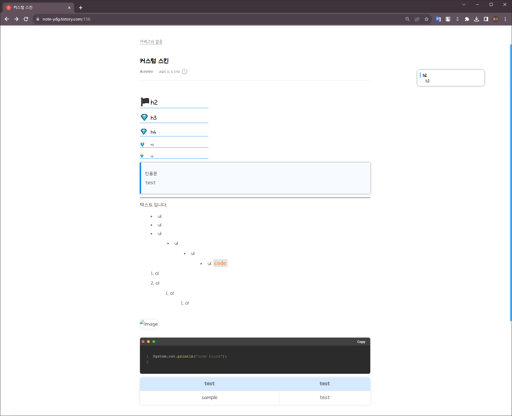

# 티스토리 커스텀 스킨
기본 스킨 'Poster'를 커스텀한 스킨입니다.
취향에 맞는다면 마음껏 쓰세요!!

## 사용방법
티스토리 관리자 페이지의 스킨 변경 들어가서 `스킨 등록` 버튼을 클릭하고 파일 목록 추가 페이지로 이동한 이후에 `sample` 폴더와 `readme.md` 제외한 나머지 파일을 모두 등록하세요.

## 사용 예시
### 메인 화면

### 글 예시

## 참고
[코드 블락 커스텀](https://guiyomi.tistory.com/132)
[highlight.js](https://highlightjs.org/)
[목차 만들기](https://jstar0525.tistory.com/256)